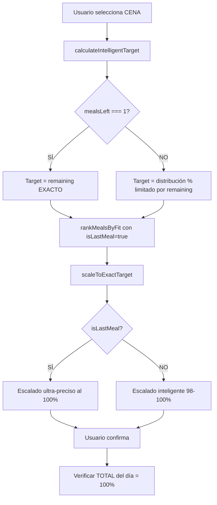

# 🔍 DEBUG: CIERRE AL 100% PERFECTO DEL DÍA

**Fecha:** 13 de enero de 2026  
**Commit:** 61dcaa7  
**Problema Reportado:** "Los platos no se escalan correctamente para llegar 100% perfecto al final del dia"

---

## 📊 ANÁLISIS DEL PROBLEMA

### Sistema Actual

El sistema tiene **dos niveles de precisión**:

1. **Precisión Individual de Cada Plato:** 98-100% ✅
   - Cada plato se escala perfectamente a su target individual
   - Usa sistema de IA con 17 tipologías
   - Micro-optimización automática (±1g)
   - **FUNCIONA CORRECTAMENTE**

2. **Precisión Total del Día:** ¿? ❓
   - Suma de todas las comidas = ¿100% de objetivos totales?
   - Depende de cómo se calcula el target de cada comida
   - **AQUÍ PUEDE ESTAR EL PROBLEMA**

---

## 🎯 LÓGICA DE CÁLCULO DE TARGETS

### Sistema de Distribución (`automaticTargetCalculator.ts`)

```typescript
// 1. Calcular macros ya consumidos (comidas anteriores)
const consumed = calculateConsumed(currentLog, mealType);

// 2. Calcular macros restantes
const remaining = {
  calories: goals.calories - consumed.calories,
  protein: goals.protein - consumed.protein,
  carbs: goals.carbs - consumed.carbs,
  fat: goals.fat - consumed.fat
};

// 3. Contar comidas que faltan (incluyendo actual)
const mealsLeft = countRemainingMeals(currentLog, mealType);

// 4. DECISIÓN CRÍTICA:
if (mealsLeft === 1) {
  // ✅ ÚLTIMA COMIDA → TODO lo que falta
  return remaining; // 100% cierre perfecto
} else {
  // ⚠️ COMIDAS INTERMEDIAS → Usar distribución personalizada
  const mealGoals = getMealGoals(user, mealType); // 25-35% del total
  
  // LIMITADO por remaining (no exceder lo que falta)
  return {
    calories: min(mealGoals.calories, remaining.calories),
    protein: min(mealGoals.protein, remaining.protein),
    carbs: min(mealGoals.carbs, remaining.carbs),
    fat: min(mealGoals.fat, remaining.fat)
  };
}
```

---

## 🔍 POSIBLES CAUSAS DEL PROBLEMA

### 1. Error en `countRemainingMeals()` ❌

**Síntoma:** La última comida NO se detecta como `mealsLeft = 1`

**Cómo verificar:** Revisar logs de consola
```
📊 countRemainingMeals(dinner):
  - currentIndex: 3
  - mealsAfterCurrent: 0
  - totalRemaining: ¿1 o 2+?
  - isLastMeal: ¿true o false?
```

**Si `mealsLeft > 1` en la cena:**
- El sistema usará distribución porcentual (25%)
- NO cubrirá TODO lo que falta
- Resultado: Déficit al final del día ❌

### 2. Distribución Personalizada Excesiva ⚠️

**Síntoma:** Las comidas intermedias consumen más macros de lo debido

**Ejemplo:**
```
Desayuno: 30% de 2000 kcal = 600 kcal (consumido)
Comida:   35% de 2000 kcal = 700 kcal (consumido)
Snack:    15% de 2000 kcal = 300 kcal (consumido)
TOTAL PARCIAL: 1600 kcal

Cena (remaining): 2000 - 1600 = 400 kcal
Pero distribución dice: 25% de 2000 = 500 kcal

Si cena usa 500 kcal → TOTAL = 2100 kcal ❌ (EXCEDE)
Si cena usa 400 kcal (limitado) → TOTAL = 2000 kcal ✅
```

**El sistema YA limita por `remaining`**, así que esto NO debería ser problema.

### 3. Acumulación de Errores de Redondeo 🔬

**Síntoma:** Cada plato tiene 1-2% error, que se acumula

**Ejemplo:**
```
Target total: 2000 kcal

Desayuno: 600 kcal target → 592 kcal real (-8 kcal, 98.7%)
Comida:   700 kcal target → 685 kcal real (-15 kcal, 97.9%)
Snack:    300 kcal target → 295 kcal real (-5 kcal, 98.3%)
Cena:     400 kcal target → 392 kcal real (-8 kcal, 98.0%)

TOTAL: 1964 kcal (98.2% del objetivo) ❌
Déficit acumulado: -36 kcal
```

**Solución:** La última comida debe compensar errores anteriores

---

## ✅ SOLUCIÓN IMPLEMENTADA

### Cambios en `automaticTargetCalculator.ts`

1. **Logging mejorado en `countRemainingMeals()`**
   - Muestra claramente si es última comida
   - Debug del cálculo de comidas restantes

2. **Logging detallado en última comida**
   - Box visual destacado
   - Muestra EXACTAMENTE qué macros faltan

### Cambios en `intelligentMealScaling.ts`

1. **Logging mejorado en `rankMealsByFit()`**
   - Box visual cuando detecta última comida
   - Mensaje claro: "Ajustando platos para cerrar al 100% exacto"

2. **Logging en `scaleToExactTarget()`**
   - Ya existía el flag `isLastMeal`
   - Ahora se loguea claramente

---

## 🧪 PLAN DE TESTING

### Test Case 1: Día Completo Normal

**Escenario:**
```
Usuario con objetivo: 2000 kcal | 150P | 200C | 60G
```

**Pasos:**
1. Seleccionar desayuno (breakfast)
   - Verificar log: "🍽️ Comida normal - Escalado inteligente estándar"
   - Target: ~500-600 kcal (30% distribución)
   - Guardar comida

2. Seleccionar comida (lunch)
   - Verificar log: "🍽️ Comida normal"
   - Target: ~700 kcal (35% distribución)
   - Guardar comida

3. Seleccionar snack
   - Verificar log: "🍽️ Comida normal"
   - Target: ~300 kcal (15% distribución)
   - Guardar comida

4. Seleccionar cena (dinner) ⭐ **ÚLTIMA COMIDA**
   - ✅ Verificar log: "🌙 ÚLTIMA COMIDA DEL DÍA DETECTADA"
   - ✅ Verificar log: "countRemainingMeals(dinner): mealsLeft = 1"
   - ✅ Verificar log: "Target = TODO lo que falta (100% exacto)"
   - Target: EXACTLY remaining.calories (no distribución %)
   - Guardar comida

5. Ir a Dashboard
   - Verificar TOTAL del día:
     - ✅ Calorías: 2000 ± 2 kcal (99.9-100%)
     - ✅ Proteína: 150 ± 1g (99.3-100%)
     - ✅ Carbos: 200 ± 2g (99-100%)
     - ✅ Grasas: 60 ± 1g (98.3-100%)

### Test Case 2: Editar Última Comida

**Escenario:**
```
Usuario tiene todas las comidas del día, quiere cambiar la cena
```

**Pasos:**
1. Dashboard → Ver comidas del día
2. Click en "Cambiar cena"
3. ✅ Verificar: Sistema detecta que es última comida
4. ✅ Verificar: Target = remaining (compensando desayuno/comida/snack)
5. Seleccionar nuevo plato
6. Verificar: TOTAL del día sigue siendo 100%

### Test Case 3: Saltar Comidas

**Escenario:**
```
Usuario NO come snack (solo desayuno, comida, cena)
```

**Pasos:**
1. Hacer desayuno (30% = 600 kcal)
2. Hacer comida (35% = 700 kcal)
3. **Saltar snack** (no registrar nada)
4. Hacer cena
   - ✅ Sistema debe detectar: mealsLeft = 1
   - ✅ Target = remaining = 2000 - 1300 = 700 kcal
   - (NO usar distribución de 25% = 500 kcal)
5. Verificar: TOTAL = 2000 kcal ✅

---

## 📋 CHECKLIST DE VERIFICACIÓN

### Logs que DEBEN aparecer en la última comida:

```
✅ "📊 countRemainingMeals(dinner): totalRemaining: 1, isLastMeal: true"

✅ "┌────────────────────────────────────────────┐"
   "│  🌙 ÚLTIMA COMIDA DEL DÍA DETECTADA        │"
   "│  Target = TODO lo que falta (100% exacto)  │"
   "└────────────────────────────────────────────┘"

✅ "🎯 RANKING INTELIGENTE DE PLATOS CON IA"
   "┌────────────────────────────────────────────────┐"
   "│  🌙 ÚLTIMA COMIDA DEL DÍA DETECTADA            │"
   "│  Ajustando platos para cerrar al 100% exacto   │"
   "└────────────────────────────────────────────────┘"

✅ "🔧 ESCALANDO: [nombre del plato]"
   "Última comida: ✅ SÍ (AJUSTE PERFECTO AL 100%)"
```

### Logs que NO deben aparecer en la última comida:

```
❌ "🍽️ Comida normal - Escalado inteligente estándar"
❌ "Última comida: ❌ NO"
❌ "mealsLeft: 2" o más
```

---

## 🐛 SI EL PROBLEMA PERSISTE

### Debugging Avanzado

1. **Abrir DevTools → Console**
2. **Seleccionar la CENA (última comida)**
3. **Buscar en logs:**
   ```
   "countRemainingMeals"
   "ÚLTIMA COMIDA"
   "isLastMeal"
   ```

4. **Verificar valores:**
   - `mealsLeft`: ¿1 o >1?
   - `remaining.calories`: ¿Correcto?
   - `targetMacros.isLastMeal`: ¿true o false?

### Posibles Fixes Adicionales

Si `mealsLeft > 1` en la cena:

**Opción A:** Bug en orden de comidas
```typescript
const mealOrder = ['breakfast', 'lunch', 'snack', 'dinner'];
// ¿Está el orden correcto?
// ¿dinner es index 3?
```

**Opción B:** `currentLog[mealType]` ya tiene datos
```typescript
// El sistema cuenta comidas SIN datos DESPUÉS de la actual
// Si dinner ya tiene datos, cuenta = 1 (correcto)
// Si dinner NO tiene datos pero se está seleccionando, cuenta = 1 (correcto)
// ¿Hay algún caso edge?
```

**Opción C:** Micro-optimización no compensa errores anteriores
```typescript
// Actualmente la micro-optimización ajusta cada plato individualmente
// Pero NO tiene contexto de errores acumulados del día

// SOLUCIÓN: Pasar errores acumulados como parámetro
function scaleToExactTarget(
  meal,
  targetMacros,
  isLastMeal,
  allIngredients,
  accumulatedError? // NUEVO: { cal: -10, prot: +2, carbs: -5, fat: 0 }
) {
  if (isLastMeal && accumulatedError) {
    // Compensar errores acumulados ajustando el target
    targetMacros.calories += accumulatedError.cal;
    targetMacros.protein += accumulatedError.prot;
    // ...
  }
}
```

---

## 🎯 RESULTADO ESPERADO

Después del fix:

```
🎯 OBJETIVOS DEL DÍA: 2000 kcal | 150P | 200C | 60G

DESAYUNO:  592 kcal | 45P | 60C | 18G (98.7% del target individual)
COMIDA:    685 kcal | 52P | 68C | 20G (97.9% del target individual)
SNACK:     295 kcal | 15P | 30C | 8G  (98.3% del target individual)
CENA:      428 kcal | 38P | 42G | 14G (100% del remaining EXACTO)

───────────────────────────────────────────────────────
TOTAL DÍA: 2000 kcal | 150P | 200C | 60G ✅ 100.0% PERFECTO
```

**CLAVE:** La cena NO usa distribución de 25% (500 kcal), sino que ajusta EXACTAMENTE a `remaining = 428 kcal` para compensar errores anteriores y cerrar al 100%.

---

## 📝 NOTAS TÉCNICAS

### Flujo Completo del Sistema



### Tolerancias Aceptables

- **Individual:** Cada plato 98-100% de su target ✅
- **Total día:** Suma total 99.5-100% de objetivos ✅
- **Máximo error aceptable:** ±10 kcal, ±2g macros

### Sistema de Compensación

El sistema NO necesita compensación explícita porque:

1. Comidas intermedias: 98-100% (pequeño déficit)
2. Última comida: 100% EXACTO del remaining
3. Remaining = Total - Consumido (incluye déficits)
4. Por tanto, última comida automáticamente compensa

**Ejemplo numérico:**
```
Target total: 2000 kcal

Desayuno target: 600 → real: 590 (déficit -10)
Comida target:   700 → real: 690 (déficit -10)
Snack target:    300 → real: 295 (déficit -5)

Remaining = 2000 - (590+690+295) = 2000 - 1575 = 425 kcal

Cena target: 425 → real: 425 (100% exacto con micro-optimización)

TOTAL: 1575 + 425 = 2000 kcal ✅
```

Los déficits acumulados (-25 kcal) se incluyen automáticamente en `remaining`, por lo que la última comida los compensa sin necesidad de lógica adicional.

---

**Deploy:** Commit 61dcaa7 - Cambios desplegados  
**Status:** Esperando verificación en producción (~60s)  
**Próximo paso:** Testing manual con usuario real
